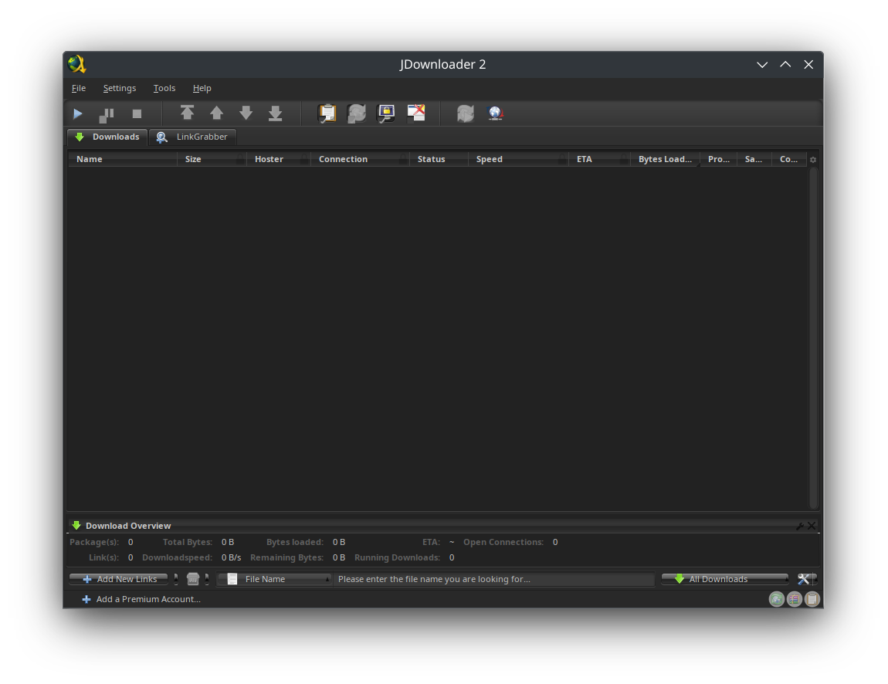

To enhance your JDownloader 2 experience, navigate to Settings > Advanced Settings and adjust the parameters to create an ad-free environment and enable a sleek dark mode that looks better to me than the default options.

| Key                                                                          | Value             |
| ---------------------------------------------------------------------------- | ----------------- |
| GraphicalUserInterfaceSettings: Banner                                       | false             |
| GraphicalUserInterfaceSettings: Donate Button State                          | Hidden (Automode) |
| GraphicalUserInterfaceSettings: Look And Feel Theme                          | BLACK_EYE         |
| GraphicalUserInterfaceSettings: Premium Alert ETA Column                     | false             |
| GraphicalUserInterfaceSettings: Premium Alert Speed Column                   | false             |
| GraphicalUserInterfaceSettings: Premium Alert Task Column                    | false             |
| GraphicalUserInterfaceSettings: Special Deal Oboom Dialog Visible On Startup | false             |
| GraphicalUserInterfaceSettings: Special Deals                                | false             |
| LAFSettings: Color For Config Header Text Color                              | \#ffffffff        |
| LAFSettings: Color For Config Panel Description Text                         | \#ffffffff        |
| LAFSettings: Color For Panel Background                                      | \#ff222222        |
| LAFSettings: Color For Panel Header Background                               | \#ff222222        |
| LAFSettings: Color For Panel Header Foreground                               | \#ffffffff        |
| LAFSettings: Color For Speed Meter Average Text                              | \#ffffffff        |
| LAFSettings: Color For Speed Meter Text                                      | \#ffffffff        |
| LAFSettings: Color For Table Account Error Row Foreground                    | \#ffffffff        |
| LAFSettings: Color For Table Account Temp Error Row Foreground               | \#ffffffff        |
| LAFSettings: Color For Table Alternate Row Background                        | \#ff222222        |
| LAFSettings: Color For Table Alternate Row Foreground                        | \#ffffffff        |
| LAFSettings: Color For Table Mouse Over Row Background                       | \#ff666666        |
| LAFSettings: Color For Table Mouse Over Row Foreground                       | \#ffffffff        |
| LAFSettings: Color For Table Package Row Background                          | \#ff333333        |
| LAFSettings: Color For Table Package Row Foreground                          | \#ffffffff        |
| LAFSettings: Color For Table Selected Rows Background                        | \#ff666666        |
| LAFSettings: Color For Table Selected Rows Foreground                        | \#ffffffff        |
| LAFSettings: Color For Tooltip Foreground                                    | \#ffffffff        |
| LAFSettings: Config Disabled Text Color                                      | \#ff666666        |
| LAFSettings: Config Enabled Text Color                                       | \#ffffffff        |
